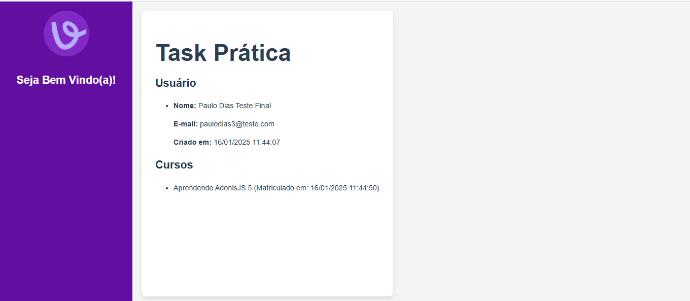

# Task Prática - Frontend

Este é o frontend da aplicação da **Task Prática** da **Vício**. Ele foi desenvolvido para consumir a API criada no backend, permitindo a gestão de usuários, cursos e matrículas.

**Repositório do Backend**: [Task Prática - Backend](https://github.com/paulodias99/Vicio---Task)

## 🖼️ Interface


## Tecnologias Utilizadas
- **React** → Biblioteca para construção da interface.
- **Axios** → Cliente HTTP para comunicação com o backend.
- **Vite** → Ferramenta de build moderna para aplicações front-end.

### **Por que Vite?**
O **Vite** é extremamente rápido e eficiente no desenvolvimento de aplicações **React**.

## Como rodar o projeto?

1. Clone o repositório:
   ```bash
   git clone https://github.com/paulodias99/Vicio---Task---Front.git
   cd Vicio---Task---Front
   ```

2. Instale as dependências:
   ```bash
   npm install
   ```

3. Inicie o servidor de desenvolvimento:
   ```bash
   npm run dev
   ```

4. Acesse a aplicação:
   - **Frontend**: `http://localhost:5173`
   - **Backend**: Certifique-se de que o backend está rodando em `http://localhost:3000`

## Observações
- O frontend consome os dados da API, então o **backend precisa estar rodando** para a aplicação funcionar corretamente.
- Para configurar o **backend**, siga as instruções no repositório [Task Prática - Backend](https://github.com/paulodias99/Vicio---Task).